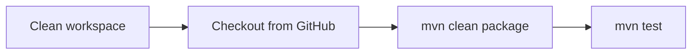

# Register App: Maven Multi-Module WAR with Jenkins CI

A Java web application with a user registration page, built as a Maven multi-module project, packaged and tested by a Jenkins pipeline, and runnable on Apache Tomcat in Docker.


<p>
  
  
  
</p>

## What this demonstrates

- A multi-module Maven build, where a library and a web application are versioned together
- A pipeline that checks out, builds and tests on a dedicated agent
- Running the resulting WAR on Tomcat in a container

## Modules

| Module | Contents |
|---|---|
| `server` | A `Greeter` class with a JUnit test |
| `webapp` | The registration page (`index.jsp`), packaged as `webapp.war` |

## Jenkins pipeline



The pipeline runs on an agent labelled `Jenkins-Agent`, uses tools named `java17` and `Maven3`, and checks out with the `github` credentials.

## Build and run

```bash
mvn clean package
docker build -t register-app .
docker run -p 8080:8080 register-app
```

Open http://localhost:8080/webapp/.

The Dockerfile starts from `tomcat:latest`, restores Tomcat's default web apps and copies in `webapp/target/*.war`.

## Credits

The registration page comes from the Virtual TechBox DevOps course, as credited on the page itself.

---

<div align="center">
  <sub>Maintained by <a href="https://github.com/RajGenStack">Rajan Kumar</a> · <a href="https://www.linkedin.com/in/rajan-kumar42">LinkedIn</a></sub>
</div>
